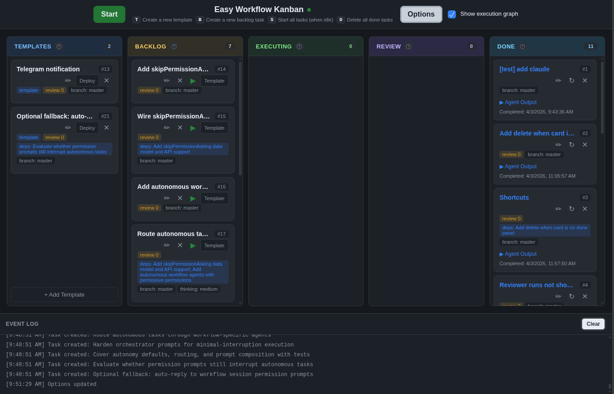
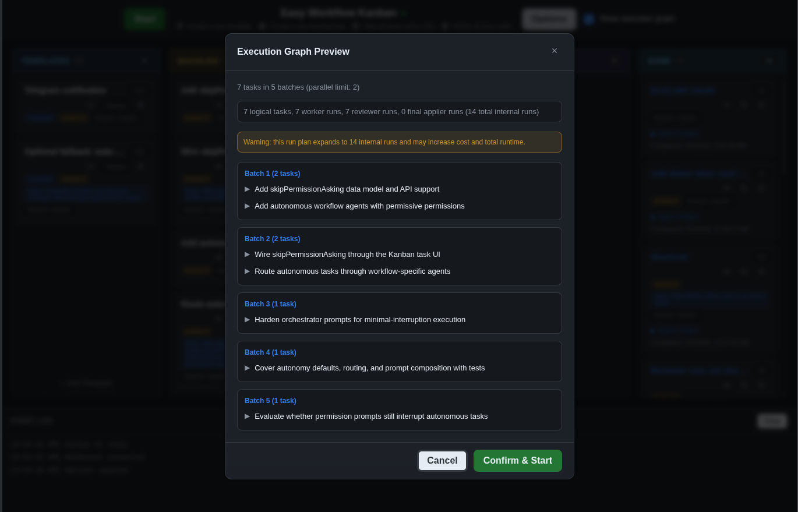

# Easy Workflow Plugin

A plugin for [OpenCode](https://opencode.ai) that provides two modes of operation:

1. **Workflow Review Mode** - Review-driven workflow triggered by `#workflow` tag
2. **Kanban Orchestrator Mode** - Full task orchestration with dependency management

It also includes a project-local skill for agents that need to translate user-provided planning material into kanban tasks.

## Screenshots




## Installation

```bash
# Install globally (copies plugin, easy-workflow/, agents, and skills to ~/.config/opencode/)
./install.ts install

# IMPORTANT: After installation, you MUST manually add the plugin to your opencode.json:
# Edit ~/.config/opencode/opencode.json and add:
#   "plugin": ["file:///home/USERNAME/.config/opencode/plugins/easy-workflow.ts"]
#
# Also ensure OPENCODE_PURE is NOT set in your environment (check with: env | grep PURE)

# Or manually copy files (source files are in root and src/ directories)
mkdir -p ~/.config/opencode/plugins
mkdir -p ~/.config/opencode/agents
mkdir -p ~/.config/opencode/skills

# Copy plugin
cp easy-workflow-bridge.ts ~/.config/opencode/plugins/easy-workflow.ts

# Copy core easy-workflow files from src/
mkdir -p ~/.config/opencode/easy-workflow/kanban
cp src/*.ts src/workflow.md ~/.config/opencode/easy-workflow/
cp src/kanban/index.html ~/.config/opencode/easy-workflow/kanban/

# Copy all agents
cp agents/*.md ~/.config/opencode/agents/

# Copy skill
cp -r skills/workflow-task-setup ~/.config/opencode/skills/

# Add to ~/.config/opencode/opencode.json:
# {
#   "$schema": "https://opencode.ai/config.json",
#   "plugin": ["file:///home/USERNAME/.config/opencode/plugins/easy-workflow.ts"]
# }
```

To remove: `./install.ts remove`

See [INSTALL.md](INSTALL.md) for details.

## Quick Start

### 0. Configure OpenCode

Add the plugin to your OpenCode configuration (`~/.config/opencode/opencode.json`):

```json
{
  "$schema": "https://opencode.ai/config.json",
  "plugin": ["file:///home/USERNAME/.config/opencode/plugins/easy-workflow.ts"]
}
```

Replace `USERNAME` with your actual username. The plugin MUST be registered with `file://` protocol.

Ensure `OPENCODE_PURE` is NOT set in your environment:
```bash
env | grep PURE  # Should return nothing
# If set, unset it: unset OPENCODE_PURE
```

### 1. Start OpenCode

```bash
opencode serve
```

The bridge plugin will automatically start the standalone server and create the initial configuration.

### 2. Access the Kanban board

Open `http://localhost:3789` locally, or `http://<machine-ip>:3789` from other devices on your network (e.g. `http://192.168.1.100:3789`)

## Mode 1: Workflow Review

Review-driven workflow that integrates with any OpenCode session.

### Usage

Add `#workflow` to the start or the end any prompt to trigger the review workflow:

```
Implement the new feature and add tests #workflow
```

### How It Works

1. Your prompt is processed by OpenCode as normal
2. When the session goes idle, the workflow review agent evaluates the changes
3. If gaps are found, you receive recommendations
4. You can continue the session or start a new one

### Configuration

Edit `.opencode/easy-workflow/workflow.md`:

```yaml
---
reviewAgent: workflow-review
---
```

## Mode 2: Kanban Orchestrator

Full task orchestration with dependency management, parallel execution, and automated review.

### Usage

1. Open the Kanban board at `http://localhost:3789` (or `http://<machine-ip>:3789` from other devices on your network)
2. Create tasks with prompts and optional dependencies
3. Click "Start" to execute

### Agent Skill: Task Setup

The repo ships with a skill at `.opencode/skills/workflow-task-setup/SKILL.md`.

Use it when an agent needs to:

- turn any user-provided plan, spec, checklist, or scope document into workflow tasks
- create or update backlog tasks and templates
- assign dependencies, ordering, and task options correctly
- understand the workflow DB layout, API, and task states before writing tasks

The skill is designed to be generic about where source material comes from, and specific about how Easy Workflow stores and executes tasks.

### Task Features

- **Dependencies**: Tasks can depend on other tasks (topological sort)
- **Parallel Execution**: Configure max parallel tasks
- **Best-of-N Execution**: Fan out one logical task into multiple worker candidates, optional reviewers, and a final applier run
- **Plan Mode**: Use OpenCode's built-in `plan` agent
- **Automated Review**: Enable review after task execution
- **Auto-commit**: Automatically commit changes to git
- **Pre-execution Commands**: Run shell commands before task execution

### Best-of-N Execution Strategy

Kanban tasks can now opt into `best_of_n` execution for multi-candidate implementation and convergence.

How it works:

1. The orchestrator expands configured worker slots into parallel worker runs.
2. Successful worker outputs are stored as candidate artifacts (`task_candidates`).
3. Optional reviewer runs evaluate candidates and provide structured guidance.
4. A final applier run executes in a fresh worktree and becomes the single merge source.
5. The board keeps one card per logical task while run-level details are available via `View Runs`.

Key behavior:

- Uses existing safe worktree merge path (no direct live-branch edits by candidates)
- Supports partial worker/reviewer failures with surfaced task/run errors
- Routes ambiguous reviewer outcomes to the existing `Review` column
- Enforces limits on expanded runs to avoid runaway execution

Best-of-N task config fields:

- `executionStrategy`: `standard` | `best_of_n`
- `bestOfNConfig.workers[]`: per-slot `model`, `count`, optional `taskSuffix`
- `bestOfNConfig.reviewers[]`: per-slot `model`, `count`, optional `taskSuffix`
- `bestOfNConfig.finalApplier`: `model`, optional `taskSuffix`
- `bestOfNConfig.selectionMode`: `pick_best` | `synthesize` | `pick_or_synthesize`
- `bestOfNConfig.minSuccessfulWorkers`: minimum successful worker threshold
- `bestOfNConfig.verificationCommand` (optional): command run in worker/final-applier worktrees

### Task States

```
Backlog → Executing → Review → Done
                      ↓
                   Failed/Stuck
```

### Creating Tasks via API

```bash
# Create Task A (use http://localhost:3789 locally, or http://<machine-ip>:3789 from other devices)
curl -X POST http://localhost:3789/api/tasks \
  -H "Content-Type: application/json" \
  -d '{
    "name": "Task A",
    "prompt": "Create a file hello.txt",
    "executionModel": "minimax/minimax-m2.7",
    "review": false,
    "autoCommit": false
  }'

# Create Task B (depends on A) - same URL pattern
curl -X POST http://localhost:3789/api/tasks \
  -H "Content-Type: application/json" \
  -d '{
    "name": "Task B",
    "prompt": "Create goodbye.txt",
    "requirements": ["<task_a_id>"],
    "executionModel": "minimax/minimax-m2.7"
  }'

# Start execution
curl -X POST http://localhost:3789/api/start
```

### Per-Task Options

| Option | Description |
|--------|-------------|
| `executionModel` | Model to use for execution (e.g., `minimax/minimax-m2.7`) |
| `executionStrategy` | `standard` or `best_of_n` |
| `bestOfNConfig` | Best-of-N worker/reviewer/final-applier configuration |
| `planModel` | Model for planning phase |
| `planmode` | Enable plan-then-execute flow |
| `review` | Run review agent after execution |
| `autoCommit` | Commit changes after execution |
| `requirements` | Array of task IDs this task depends on |

### Best-of-N API Endpoints

- `GET /api/tasks/:id/runs` - child run records (`worker`, `reviewer`, `final_applier`)
- `GET /api/tasks/:id/candidates` - successful worker candidate artifacts
- `GET /api/tasks/:id/best-of-n-summary` - aggregated counts/status for card/modal UI

## Architecture

**NEW in v2.0**: Split architecture with standalone server + bridge plugin

```
┌─────────────────────────────────────────────────────────────────────────┐
│                         STANDALONE SERVER                               │
│  ┌─────────────┐  ┌─────────────┐  ┌────────────────┐  ┌──────────┐   │
│  │   Server    │  │  Database   │  │ Orchestrator   │  │  Config  │   │
│  │(HTTP/WS)    │  │  (SQLite)   │  │ (Task Runner)  │  │  (JSON)  │   │
│  │ :3789       │  │             │  │                │  │          │   │
│  └──────┬──────┘  └──────┬──────┘  └───────┬────────┘  └────┬─────┘   │
│         │                │                  │                │         │
│         └────────────────┴──────────────────┴────────────────┘         │
│                                      │                                  │
│                                      ▼                                  │
│                            ┌─────────────────┐                          │
│                            │   Worktrees     │                          │
│                            │   (Git)         │                          │
│                            └─────────────────┘                          │
└─────────────────────────────────────────────────────────────────────────┘
                                    ▲
                                    │ HTTP API
┌───────────────────────────────────┼─────────────────────────────────────┐
│           OPENCODE SERVER         │                                     │
│  ┌─────────────────┐  ┌───────────┴──────────┐  ┌─────────────────┐    │
│  │   Bridge Plugin │  │      SDK v2          │  │   Agents        │    │
│  │(easy-workflow.ts)│  │   (create sessions)  │  │(workflow-review)│    │
│  │ :forwards events │  │                      │  │                 │    │
│  └─────────────────┘  └──────────────────────┘  └─────────────────┘    │
│                                                                         │
│  Events forwarded:                                                      │
│  - chat.message (detects #workflow)                                    │
│  - permission.asked (auto-reply for workflow sessions)                 │
│  - session.idle (trigger reviews)                                      │
└─────────────────────────────────────────────────────────────────────────┘
```

### Why Standalone?

1. **No Model Loading Issues** - Runs outside OpenCode's plugin system
2. **Independent Lifecycle** - Start/stop without restarting OpenCode
3. **Better Debugging** - Console logs and errors are visible
4. **Configuration** - Simple JSON config file
5. **Clear Separation** - Bridge handles OpenCode integration, server handles logic

### Configuration

The standalone server uses `.opencode/easy-workflow/config.json`:

```json
{
  "opencodeServerUrl": "http://localhost:4096",
  "projectDirectory": "/path/to/project"
}
```

To reconfigure, delete this file and restart the server.

## Workflow vs Kanban Comparison

| Feature | Workflow | Kanban |
|---------|----------|--------|
| Trigger | `#workflow` tag | Manual start |
| Scope   | Single task | Multiple tasks |
| Dependencies | No | Yes |
| Parallel execution | No | Yes |
| Review iterations | Configurable | Configurable |
| Git worktree | No | Yes |
| Auto-commit | No | Yes |

## Files

**Source Files (for development):**
```
.
├── easy-workflow-bridge.ts       # Bridge plugin (forwards events)
├── src/                          # Standalone server source
│   ├── standalone.ts             # STANDALONE SERVER ENTRY POINT
│   ├── workflow.md               # Workflow template
│   ├── db.ts                     # SQLite database
│   ├── server.ts                 # HTTP/WebSocket server
│   ├── orchestrator.ts           # Task orchestration
│   ├── types.ts                  # TypeScript types
│   └── kanban/
│       └── index.html            # Kanban UI
├── agents/                       # Agent definitions
│   └── workflow-*.md
└── skills/
    └── workflow-task-setup/      # Agent skill
        └── SKILL.md
```

**Runtime Files (created on first run):**
```
.opencode/
└── easy-workflow/
    ├── config.json               # Server configuration (auto-created)
    └── tasks.db                  # Production task database
```

The `.opencode/` directory in this project is for **runtime only** - it contains config and database for development/testing. The source files are in the root directory and `src/` directory, which get installed globally via `./install.ts install`.

## Testing

```bash
# Test workflow mode
bun test-workflow.ts

# Test kanban orchestrator
bun test-kanban-orchestrator.ts
```

## License

MIT

## Thanks to Cline for Inspirations (ok, I just copied :P) and the Opencode team for the amazing product
